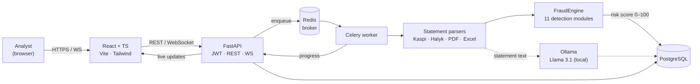

<div align="center">

# ntFAST

### Network Transaction Fraud Analysis System

**Privacy-first platform for analyzing bank statements and detecting financial fraud — powered by a local LLM, so sensitive data never leaves the server.**

[](https://www.python.org/)
[](https://fastapi.tiangolo.com/)
[](https://react.dev/)
[](https://www.typescriptlang.org/)
[](https://www.postgresql.org/)
[](https://www.docker.com/)
[-000000?logo=ollama&logoColor=white)](https://ollama.com/)

</div>

---

## Overview

**ntFAST** ingests bank statements (Kaspi, Halyk and generic Excel / PDF / CSV), normalizes the transactions, and runs them through a **11-module fraud-detection engine** that combines rule-based, statistical and graph analysis into a single explainable **risk score (0–100)**.

The whole stack runs **on-premise**: parsing, scoring and the language model (Llama 3.1 via Ollama) all execute locally. No transaction ever leaves the machine — a hard requirement for handling financial data under Kazakhstan's Personal Data Protection Law (№94-V).

> Built as a graduation project (Software Engineering) — awarded a copyright certificate, a 1st-degree diploma at an international student competition, and a conference publication.

---

## Screenshots

<div align="center">


*Analyst dashboard — checks run, average risk, processed volume and the monthly breakdown.*

<table>
<tr>
<td width="50%"></td>
<td width="50%"></td>
</tr>
<tr>
<td align="center"><em>Report overview — cash-flow totals, account details and the composite risk score.</em></td>
<td align="center"><em>Antifraud section — risk gauge, per-module radar and the individual detector scores.</em></td>
</tr>
<tr>
<td width="50%"></td>
<td width="50%"></td>
</tr>
<tr>
<td align="center"><em>Financial section — monthly income/expense dynamics and category breakdowns (Recharts).</em></td>
<td align="center"><em>Live analysis progress, streamed to the browser over WebSocket while the file is parsed.</em></td>
</tr>
</table>

</div>

---

## Key Features

- 📄 **Smart statement parsing** — Kaspi Bank & Halyk Bank layouts plus generic Excel / PDF / CSV, with automatic transaction normalization and de-duplication.
- 🛡️ **11-module fraud engine** — rules + statistics (Z-score, IQR, Benford's Law) + graph analysis, aggregated into a weighted **composite risk score** with `LOW / MEDIUM / HIGH / CRITICAL` bands. Ten modules carry weight; see the [module table](#fraud-detection-engine) for exactly which.
- 🧠 **Local LLM (Llama 3.1 via Ollama)** — contextual analysis of statement text without sending data to any cloud. Used by the PDF-analysis service; it is **not** part of the composite risk score.
- ⚡ **Async processing** — heavy parsing & scoring run in Celery workers; the UI streams live progress over WebSocket.
- 🔐 **Auth & security** — JWT authentication, bcrypt password hashing, role-based access (admin / analyst), email verification, login history and active-session management.
- 🔔 **Real-time notifications** — persistent bell-icon notifications + WebSocket events (new login, parallel session, analysis finished).
- 🌐 **Trilingual UI** — Kazakh / Russian / English (i18next), with light & dark themes.
- 📊 **Dashboards & reports** — interactive charts (Recharts) and exportable PDF reports.

---

## Architecture



**Three tiers:** React client → FastAPI server → AI/analysis layer. Postgres is the source of truth; Redis backs both the Celery queue and caching; the LLM runs as a separate local service on the statement-text path (dashed), independent of the scoring engine.

---

## Tech Stack

| Layer | Technologies |
|-------|--------------|
| **Backend** | Python 3.11 · FastAPI · SQLAlchemy 2 · Pydantic 2 · Alembic |
| **Async / Queue** | Celery · Redis 7 |
| **Database** | PostgreSQL 16 (SQLite fallback) |
| **AI / ML** | Ollama (Llama 3.1) · pandas · NLP · statistical models (Z-score, IQR, Benford) |
| **Parsing** | pdfplumber · openpyxl · xlrd · python-dateutil |
| **Auth** | python-jose (JWT) · passlib + bcrypt |
| **Frontend** | React 18 · TypeScript 5 · Vite 5 · Tailwind CSS 3 |
| **UI** | Framer Motion · Recharts · react-i18next · lucide-react · sonner |
| **Infra** | Docker Compose (5 services) · Railway |

---

## Fraud Detection Engine

`backend/app/services/fraud/engine.py` orchestrates independent detectors and merges their signals into one composite score:

| Module | What it catches | Weight |
|--------|-----------------|--------|
| `structuring` | Smurfing — amounts split to stay under reporting thresholds | 0.18 |
| `velocity` | Abnormal transaction frequency / bursts | 0.15 |
| `merchant_risk` | High-risk merchant / category exposure | 0.15 |
| `graph_analysis` | Suspicious counterparty networks & money flows | 0.12 |
| `pattern_detector` | Generic statistical anomaly patterns | 0.12 |
| `profile_mismatch` | Activity inconsistent with the subject's profile | 0.09 |
| `cross_reference` | Links across subjects and accounts | 0.08 |
| `night_transactions` | Unusual activity during night hours | 0.05 |
| `duplicate_detector` | Repeated / cloned transactions | 0.03 |
| `round_amounts` | Artificially round-number transfers | 0.03 |
| `behavioral` | Deviation from historical behaviour — **disabled**, needs >6 months of history | 0.00 |
| `account_profiler` | Builds the behavioural baseline that selects the weight multipliers | support |
| `whitelist` | Suppresses known-good counterparties before scoring, to cut false positives | support |

Weights come from `BASE_WEIGHTS` in `engine.py` and are then scaled per account type
(a business owner's night activity is weighted lower than a pensioner's, and so on).

→ **Composite risk score 0–100** → `LOW · MEDIUM · HIGH · CRITICAL`, each flag fully explainable.

**One module is implemented but not wired in:** `nlp_analyzer.py` holds the LLM-driven
contextual analysis, and `FraudEngine.full_analysis()` never calls it — the composite score
today is rules and statistics only. It is named here rather than quietly counted among the
modules above.

---

## Performance & Accuracy

Every number below comes from [`scripts/benchmark.py`](scripts/benchmark.py), which you can
run yourself. The full report, including the machine it ran on, is checked in at
[`docs/benchmarks/latest.md`](docs/benchmarks/latest.md).

```bash
python scripts/benchmark.py --runs 5 --transactions 500
```

### Latency — 500-transaction statement, end to end

File → bank detection → parsing → categorisation → analytics → 11-module engine → risk score.

| Input | Median | Min–max | Parsing | Engine |
|---|---|---|---|---|
| Excel (.xlsx) | **0.11 s** | 0.11–0.16 s | 0.06 s | 0.03 s |
| PDF (ruled table) | **3.03 s** | 2.98–3.18 s | 2.98 s | 0.03 s |

Five measured runs after a discarded warm-up. Parsing dominates: PDF text extraction
(pdfplumber) is ~50× the cost of reading the same statement from Excel, while the scoring
engine itself is a rounding error at this size.

### Extraction accuracy

A row counts as recovered when a parsed transaction carries the same date and amount
(±0.01), and as fully correct when the description survives too.

| Layout | Rows recovered | Fully correct |
|---|---|---|
| Excel (.xlsx) | 500 / 500 — **100%** | 100% |
| PDF — ruled table | 500 / 500 — **100%** | 100% |
| PDF — multipage, running headers/footers | 500 / 500 — **100%** | 100% |
| PDF — flat text, no table | 500 / 500 — **100%** | 100% |

The last row used to read 0%, and the way it failed is worth keeping on the record: the
amount regex matched the leading date, so `06.01.2025 … -26 341,94` was extracted as an
amount of `6.01`. Transactions were still created, with correct dates and invented amounts —
a statement turning over millions looked like one turning over a few hundred tenge, and the
fraud engine scored it LOW in good faith. The amount is now read only after the date and only
in money format, and the text fallback is decided per page instead of being switched off
after the first five rows.

### Real statements

The synthetic figures above measure layouts this repository generates itself. Against the
author's own statements — Kaspi and Halyk in Russian, Kazakh and English, plus a Binance
export — the parsers recover **9 of 9 files**, and the three language variants of the same
document produce identical totals (Kaspi 1320 transactions, Halyk 34). Those files contain
personal data and are not in the repository.

### Detection output

On transactions carrying full metadata (counterparty, merchant, salary/ATM flags — what the
Kaspi and Halyk parsers produce), the engine scored the synthetic fraud profile at
**70/100 → HIGH with 38 explained red flags**. Fed the same statement through the *generic*
parser, which recovers only date/amount/description, the same engine returns **1.6 → LOW**.
Detection quality tracks parser richness, not just transaction count.

### Method and limits

- **Sample:** 500 synthetic transactions from a seeded generator (`seed=42`) — salary,
  everyday spending, P2P movement, round amounts, sub-threshold structuring, night activity.
- **Runs:** 5 measured per input, one warm-up discarded; median and spread reported, never a
  single lucky number.
- **Machine:** Intel Core i7 (Kaby Lake, 4 logical cores), 8 GB RAM, Python 3.11.9, Windows.
- **Synthetic only.** Accuracy here is parser fidelity on layouts this repository generates
  itself. Accuracy on genuine Kaspi/Halyk exports is **not measured** — no real statement is
  used anywhere in this project's tests, by design.
- **No LLM in these numbers.** `FraudEngine.full_analysis()` does not call Ollama, so the
  timings are identical whether or not a local model is running.

---

## Quick Start

### Option A — Docker

> **One manual step first.** `docker-compose.yml` reads `.env.docker`, and that file is
> deliberately not in the repository. Create it before anything else or compose exits
> immediately with *env file not found*.

```bash
git clone https://github.com/taaazhi/ntFAST.git
cd ntFAST
cp .env.docker.example .env.docker      # required — compose will not start without it
docker compose up --build
```

Optionally set a real `SECRET_KEY` in `.env.docker` before starting
(`python -c "import secrets; print(secrets.token_hex(32))"`). With `DEBUG=true` the app
generates an ephemeral key instead, which logs everyone out on every restart.

Compose boots **5 services** with health-checks and the correct start order:
`postgres` → `redis` → `backend` + `celery_worker` → `frontend`. Database tables are created
by the backend at startup, so no migration step is needed for this path.

- Frontend → http://localhost
- API + Swagger docs → http://localhost:8000/docs

**Before you start:**

| | |
|---|---|
| First build | 5–10 minutes on a warm connection — Python and Node images plus a full `npm install` and Vite build. Subsequent starts take seconds. *Estimate from the image and dependency set, not timed on a clean machine.* |
| Disk | ~3 GB of images and volumes |
| RAM | ~2 GB for the five containers |
| Published ports | `80`, `8000`, `5432`, `6379` — stop any local Postgres, Redis or web server first, or change the mappings |

> **Ollama is not part of compose.** The five services run without a language model. To use
> the LLM features, run Ollama on the host (`ollama pull llama3.1`) — the containers reach it
> through `host.docker.internal`, already configured in `.env.docker.example`. Llama 3.1 8B
> needs about 5 GB of disk and 8 GB of free RAM **on top of** the figures above. None of this
> affects the risk score, which is computed without the LLM.

### Option B — Manual (local dev)

> Requires Python 3.11, Node 18+, PostgreSQL 16, Redis 7, and [Ollama](https://ollama.com/) with `ollama pull llama3.1`.

```bash
# Backend
cd backend
pip install -r requirements.txt
cp .env.example .env
alembic upgrade head
uvicorn app.main:app --reload --port 8000

# Celery worker (separate terminal)
celery -A app.core.celery_app worker --loglevel=info --pool=solo

# Frontend (separate terminal)
cd frontend
npm install
npm run dev
```

---

## Project Structure

```
ntfast/
├── backend/
│   └── app/
│       ├── api/          # REST routers (auth, analyses, subjects, transactions, …)
│       ├── core/         # config, database, security, celery
│       ├── models/       # SQLAlchemy models (user, subject, transaction, …)
│       ├── schemas/      # Pydantic schemas
│       ├── services/
│       │   ├── fraud/         # the 11-module detection engine
│       │   ├── bank_analyzer/ # statement parsers (Kaspi, Halyk, …)
│       │   └── …
│       ├── tasks/        # Celery tasks
│       └── middleware/   # security headers, etc.
├── frontend/
│   └── src/              # React + TypeScript app (components, locales, pages)
├── docs/                 # technical docs + architecture diagram (.drawio)
├── test_data/            # synthetic sample statements
└── docker-compose.yml
```

---

## Testing

```bash
cd backend
pytest
```

The fraud engine and parsers are covered by an automated test suite (`backend/tests/`).

---

## Roadmap

- [ ] Public REST API for third-party integrations
- [ ] Graph database (Neo4j) for deeper network analysis
- [ ] React Native mobile client
- [ ] Federated learning across institutions

---

## License

Released under the [MIT License](LICENSE).

<div align="center">

**ntFAST** — made in Kazakhstan 🇰🇿 · backend + AI + frontend by [@taaazhi](https://github.com/taaazhi)

</div>
