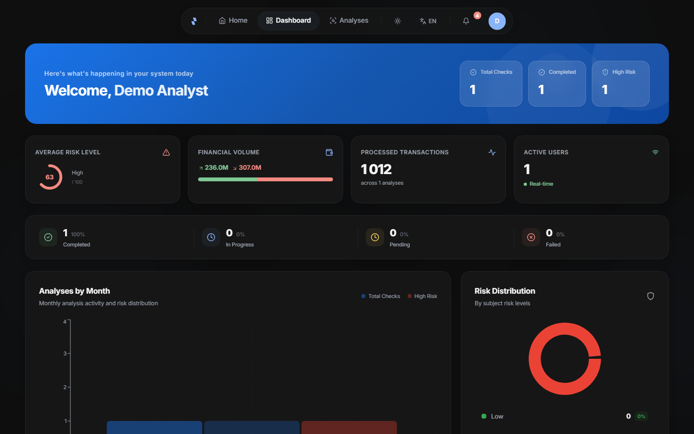
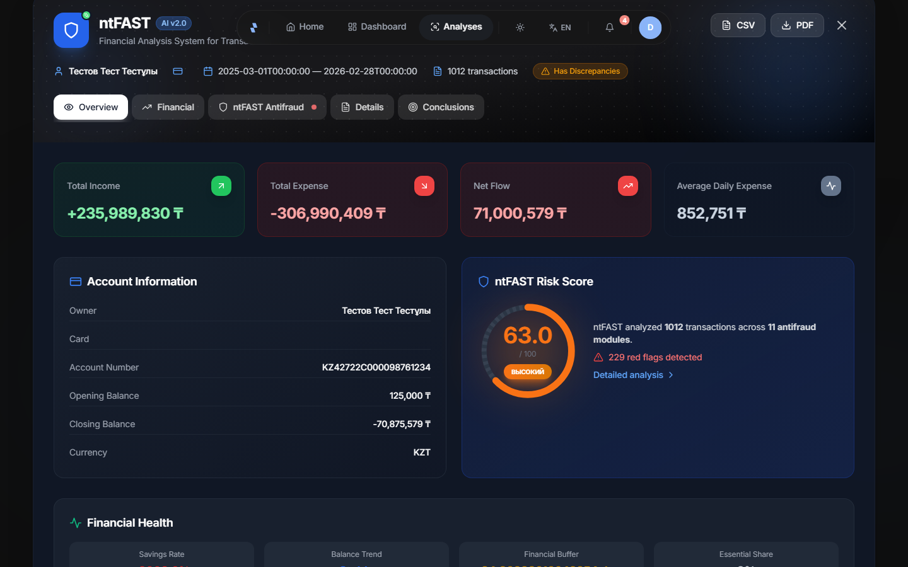
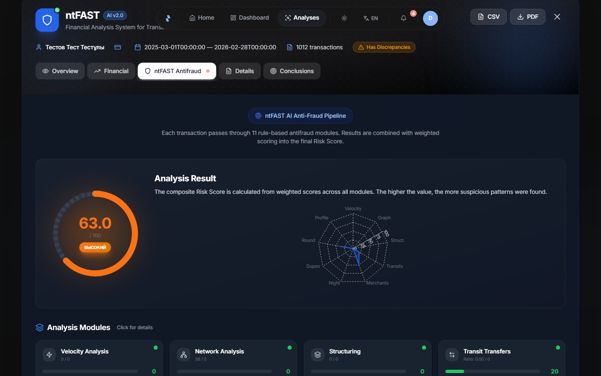
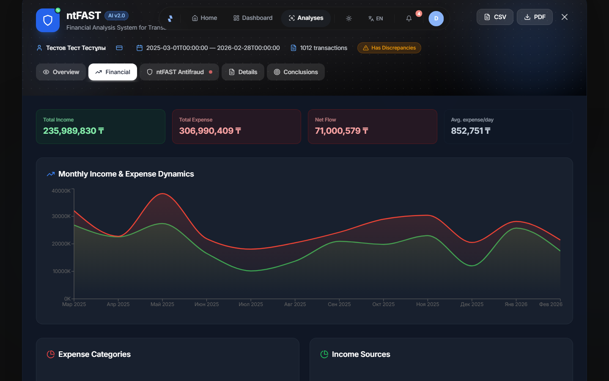
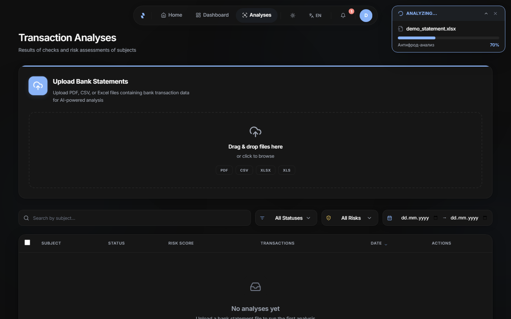
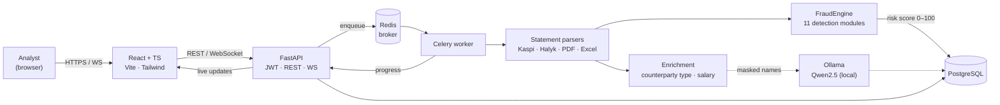

<div align="center">

# ntFAST

### Network Transaction Fraud Analysis System

**Privacy-first platform for analyzing bank statements and detecting financial fraud — powered by a local LLM, so sensitive data never leaves the server.**

[](https://github.com/taaazhi/ntFAST/actions/workflows/ci.yml)
[](https://www.python.org/)
[](https://fastapi.tiangolo.com/)
[](https://react.dev/)
[](https://www.typescriptlang.org/)
[](https://www.postgresql.org/)
[](https://www.docker.com/)
[%20%C2%B7%20Claude-000000?logo=ollama&logoColor=white)](https://ollama.com/)

</div>

---

## Overview

**ntFAST** ingests bank statements (Kaspi, Halyk and generic Excel / PDF / CSV), normalizes the transactions, and runs them through a **11-module fraud-detection engine** that combines rule-based, statistical and graph analysis into a single explainable **risk score (0–100)**.

The whole stack runs **on-premise**: parsing, scoring and the language model (Qwen2.5 via Ollama) all execute locally, and that is the default rather than a fallback. No transaction leaves the machine — a hard requirement for financial data under Kazakhstan's Personal Data Protection Law (№94-V). A cloud provider (Claude) can be enabled explicitly; everything sent to it passes through the anonymiser first.

> Built as a graduation project (Software Engineering) — awarded a copyright certificate, a 1st-degree diploma at an international student competition, and a conference publication.

---

## Screenshots

<div align="center">



*Analyst dashboard — checks run, average risk, processed volume and the monthly breakdown.*

<table>
<tr>
<td width="50%"></td>
<td width="50%"></td>
</tr>
<tr>
<td align="center"><em>Report overview — cash-flow totals, account details and the composite risk score.</em></td>
<td align="center"><em>Antifraud section — risk gauge, per-module radar and the individual detector scores.</em></td>
</tr>
<tr>
<td width="50%"></td>
<td width="50%"></td>
</tr>
<tr>
<td align="center"><em>Financial section — monthly income/expense dynamics and category breakdowns (Recharts).</em></td>
<td align="center"><em>Live analysis progress, streamed to the browser over WebSocket while the file is parsed.</em></td>
</tr>
</table>

</div>

---

## Key Features

- 📄 **Smart statement parsing** — Kaspi Bank & Halyk Bank layouts plus generic Excel / PDF / CSV, with automatic transaction normalization and de-duplication.
- 🛡️ **11-module fraud engine** — rules + statistics (Z-score, IQR, Benford's Law) + graph analysis, aggregated into a weighted **composite risk score** with `LOW / MEDIUM / HIGH / CRITICAL` bands. Ten modules carry weight; see the [module table](#fraud-detection-engine) for exactly which.
- 🧠 **Local LLM (Qwen2.5 3B via Ollama)** — writes the case conclusion, classifies counterparties and answers an investigator's questions, without sending anything to a cloud. Measured: counterparty classification goes from 58.5% to **89.0%** on a labelled set. The model does **not** compute the risk score — that stays rules and statistics.
- 📝 **Case conclusion** — the one job rules cannot do: turning eleven module scores, a counterparty graph and the applicable statutes into a text an investigator reads. Every number in it is checked against the facts, every statute against the official corpus.
- 🔎 **Investigative agent** — asks the system rather than reasoning over the raw statement: six tools for transactions, counterparties, periods, risk breakdown and legislation. Tool results are masked, so names never reach the model.
- ⚖️ **Statute corpus with citation checking** — 1319 articles of the Criminal, Tax and AML codes pulled from adilet.zan.kz. Every reference printed in a report is verified against the official text; an invented article number is caught rather than displayed.
- ⚡ **Async processing** — heavy parsing & scoring run in Celery workers; the UI streams live progress over WebSocket.
- 🔐 **Auth & security** — JWT authentication, bcrypt password hashing, role-based access (admin / analyst), email verification, login history and active-session management.
- 🔔 **Real-time notifications** — persistent bell-icon notifications + WebSocket events (new login, parallel session, analysis finished).
- 🌐 **Trilingual UI** — Kazakh / Russian / English (i18next), with light & dark themes.
- 📊 **Dashboards & reports** — interactive charts (Recharts) and exportable PDF reports.

---

## Architecture



**Three tiers:** React client → FastAPI server → AI/analysis layer. Postgres is the source of truth; Redis backs both the Celery queue and caching; the LLM runs as a separate local service on the statement-text path (dashed), independent of the scoring engine.

---

## Tech Stack

| Layer | Technologies |
|-------|--------------|
| **Backend** | Python 3.11 · FastAPI · SQLAlchemy 2 · Pydantic 2 · Alembic |
| **Async / Queue** | Celery · Redis 7 |
| **Database** | PostgreSQL 16 (SQLite fallback) |
| **AI / ML** | Ollama (Qwen2.5 3B, local) · Anthropic Claude (optional) · pandas · statistical models (Z-score, IQR, Benford) |
| **Parsing** | pdfplumber · openpyxl · xlrd · python-dateutil |
| **Auth** | python-jose (JWT) · passlib + bcrypt |
| **Frontend** | React 18 · TypeScript 5 · Vite 5 · Tailwind CSS 3 |
| **UI** | Framer Motion · Recharts · react-i18next · lucide-react · sonner |
| **Infra** | Docker Compose (5 services) · Railway |

---

## Fraud Detection Engine

`backend/app/services/fraud/engine.py` orchestrates independent detectors and merges their signals into one composite score:

| Module | What it catches | Weight |
|--------|-----------------|--------|
| `structuring` | Smurfing — amounts split to stay under reporting thresholds | 0.18 |
| `velocity` | Abnormal transaction frequency / bursts | 0.15 |
| `merchant_risk` | High-risk merchant / category exposure | 0.15 |
| `graph_analysis` | Suspicious counterparty networks & money flows | 0.12 |
| `pattern_detector` | Generic statistical anomaly patterns | 0.12 |
| `profile_mismatch` | Activity inconsistent with the subject's profile | 0.09 |
| `cross_reference` | Links across subjects and accounts | 0.08 |
| `night_transactions` | Unusual activity during night hours | 0.05 |
| `duplicate_detector` | Repeated / cloned transactions | 0.03 |
| `round_amounts` | Artificially round-number transfers | 0.03 |
| `behavioral` | Deviation from historical behaviour — **disabled**, needs >6 months of history | 0.00 |
| `account_profiler` | Builds the behavioural baseline that selects the weight multipliers | support |
| `whitelist` | Suppresses known-good counterparties before scoring, to cut false positives | support |

Weights come from `BASE_WEIGHTS` in `engine.py` and are then scaled per account type
(a business owner's night activity is weighted lower than a pensioner's, and so on).

→ **Composite risk score 0–100** → `LOW · MEDIUM · HIGH · CRITICAL`, each flag fully explainable.

**One module is implemented but not wired in:** `nlp_analyzer.py` holds the LLM-driven
contextual analysis, and `FraudEngine.full_analysis()` never calls it — the composite score
today is rules and statistics only. It is named here rather than quietly counted among the
modules above.

---

## Legal Grounding

A risk score without a legal basis is an opinion. Every scheme the detector reports carries the
norm it is qualified under, and that reference is checked against the official text rather than
trusted.

```bash
python scripts/fetch_legal_corpus.py    # 1319 articles from adilet.zan.kz
```

The corpus covers the Criminal Code, the Tax Code and the AML law №191-IV. It is **not** committed:
statute texts run to megabytes and are amended several times a year, and a stale copy of a law
inside an investigative tool is worse than none, because it still looks authoritative. What is
committed is the verifier.

| Verdict | Meaning |
|---|---|
| `VERIFIED` | article exists and the title matches |
| `ARTICLE_NOT_FOUND` | no such number — the typical model invention |
| `TITLE_MISMATCH` | real number, different norm |
| `QUOTE_NOT_FOUND` | a paraphrase presented as a quotation |
| `CORPUS_UNAVAILABLE` | nothing to check against |

That last verdict is deliberately distinct from "wrong": *unable to verify* must not read as
*refuted*, and statement analysis has to keep working without the corpus.

Checking the existing references found that **five of six were wrong**: fraud was cited as
ст. 205 (actually "unlawful access to information"), human trafficking as ст. 135 ("trafficking
in minors"), the financial pyramid as ст. 216 ("fictitious invoices"), and the single most
relevant article to this project — ст. 218, laundering — was not cited anywhere. They had been
written from memory. The report now links each article straight to its anchor on adilet.zan.kz,
so an investigator reads the norm rather than taking the system's word for it.

### Retrieval — measured, then improved

Verification catches a wrong citation, but there is an earlier question: does the search even
*find* the right article when the query is phrased in an investigator's own words? If it doesn't,
the model has no norm to cite and the whole grounding step is empty. So retrieval is measured, not
assumed — [`scripts/eval_retrieval.py`](scripts/eval_retrieval.py) runs 15 natural-language queries
against a committed fixture of real articles and reports hit@5 and MRR. No model is involved; the
search is deterministic, so this runs in CI as a regression gate.

The first ranking was plain stemmed word-overlap. On the full corpus it lost the right article for
three queries in fifteen — *fraud* was outranked by *embezzlement*, *sham business* by *pyramid*.
Replacing it with **BM25** (rare words weigh more, title counts triple, length-normalised) closed
the gap:

| Corpus | metric | word-overlap | BM25 |
|---|---|---|---|
| full corpus (~1300 articles) | hit@5 | 80% | **100%** |
| full corpus | MRR | 0.767 | **0.967** |
| committed fixture | MRR | 0.878 | **1.000** |

The number is what forced the change, and the number is what guards it: a floor of hit@5 = 100% /
MRR ≥ 0.95 on the fixture is asserted in the test suite, so a future tweak to the stemmer or the
scoring that quietly degrades ranking fails red.

---

## Reading an Unfamiliar Bank

Three banks have parsers: Kaspi, Halyk, Binance. Everything else goes through
a generic path that recognises columns from a dictionary of header names — a
dictionary covering the wordings somebody has actually seen. Kazakhstan has
rather more than three banks.

What happens to the rest was measured. A statement headed `Күні/Дата`, `Мәні`,
`Кредит теңге`, `Сальдо` produced:

| | dictionary only | with the model |
|---|---|---|
| Rows recovered | **0 / 200** | **200 / 200** |
| Spurious rows | 201 | 0 |
| Counterparties | 0 | 200 |
| Time | instant | 9 s |

The failure mode matters more than the number. The parser did not stop — it
returned 201 transactions whose amounts were the running account balance, with
the reporting period as the first "transaction", and reported success. In an
investigative tool a silent substitution of amounts is worse than a crash.

The model does one thing here: it reads the header and four rows and says what
each column means. It never sees the transactions and never extracts a value —
the code still does that. Its answer is then checked against the data itself: a
column declared to hold dates must contain dates, a column declared numeric must
contain numbers. An answer that fails the check is discarded and the file falls
back to the dictionary, so a missing model degrades an unfamiliar format rather
than breaking a familiar one.

The layout is cached per header. Without that the model was queried once per
page — four times for the same table — and on one of those pages it answered
differently, which cost 52 rows and four times the latency. One file, one
question.

Enrichment through the model is a different story, and the measurement settled
it. Classifying counterparties during an analysis was timed across all eight
real statements:

| | model in the analysis | rules only |
|---|---|---|
| Binance (252 counterparties) | 538 s | 9 s |
| Kaspi × 3 | 122–132 s each | ~20 s each |
| Halyk × 4 | 10–37 s each | 1–4 s each |
| **All eight** | **1006 s** | **83 s** |

Every file still produced the correct transaction count — the model was not
wrong, it was slow. Twelvefold slower for a lift from 58.5% to 89.0% is not a
trade worth making while an investigator waits, so classification during
analysis is off by default (`AI_ENRICHMENT_IN_ANALYSIS`). Rules answer
instantly and already cover brands, legal entities, sole traders and channels.

When it is switched on, only the 60 largest counterparties by turnover reach
the model. That is not merely cheaper: an investigator cares who received the
large sums, not how three hundred small shop purchases are labelled.

---

## The Conclusion

This is where the language model does work nothing else can do, and it sits on
the main path rather than beside it.

The engine produces eleven module scores, a counterparty graph, detected schemes
and the statutes they fall under. Turning that into a **conclusion** — what
happened on the account, which signs combine into a picture, what argues against
that reading, which norms apply and what is still missing — was left to the
investigator's head, case after case. Rules cannot write that text.

```
POST /api/analyses/{id}/conclusion
```

Three conditions make it usable rather than dangerous, because this text goes
into a case file:

**The model does not calculate.** It receives figures already computed and
pre-formatted as strings, and every number in the finished text is checked back
against those facts. This is not theoretical — on the first real run the model
wrote *"12 transfers totalling 4 500 000 ₸"*, a figure it had taken from an
example in the system prompt and presented as fact about the account. It also
recomputed sums into millions and got them wrong. Nine invented numbers, caught,
conclusion marked untrustworthy. After the prompt was fixed and amounts were
passed as formatted strings: zero.

**The model does not invent norms.** Only verified articles reach it, and any
citation in the output is re-checked against the corpus afterwards.

**Refusal is loud.** No model means no conclusion — faking an absent finding in
an investigative document is worse than not producing one.

Two further defects surfaced on live runs and are now pinned by tests: the model
attributed the account holder's actions to a masked counterparty (`[PERSON_1]
made 5 purchases` — the purchases were the holder's), and Qwen2.5, trained partly
on Chinese, occasionally leaked characters into the Russian text. Both are
detected; the second is why `is_trustworthy` also checks for foreign script.

Measured on a real 1320-transaction statement through the API: 24–28 s on the
local model, zero invented numbers, both statute citations verified,
`is_trustworthy: true`.

### Measured on a labelled set

One good conclusion proves nothing. `backend/tests/data/conclusion_eval.json`
holds **16 labelled cases** — from a clean salary account to a pyramid, from a
transit account to a nearly empty one — and `scripts/eval_conclusion.py` scores
four properties that can be checked without a human:

| Property | What it catches |
|---|---|
| No invented numbers | A figure that reads as established but came from nowhere |
| Coverage | A module that scored points but went unmentioned |
| Restraint | A statute, scheme or verdict that was not in the facts |
| Counter-argument | A document that states only the case for the prosecution |

Two defects surfaced on the very first run. On the case with almost no facts —
seven transactions, no flags — the model looped forever (*"electronic money,
electronic wallets, electronic money…"*) because there was no output limit and
temperature 0 leaves no randomness to escape a loop; 300 s became 20 s once
`num_predict` and `repeat_penalty` were set. Worse, the invented-number check
treated a comma as a decimal point, so `84,000 ₸` became 84 and a **correct**
conclusion was declared untrustworthy — a false accusation is worse than no
check at all.

Then the prompt was changed. The system prompt had forbidden recalculation from
the start; a 3B model does not hold a general rule. It holds a concrete list, so
the numbers that appear in the facts are now attached to the task itself, after
the facts rather than before — the last instruction is the one that sticks.

| Metric — qwen2.5:3b, temperature 0 | General ban | Explicit list |
|---|---|---|
| Conclusion usable as a whole | 18.8% | **31.2%** |
| No invented numbers | 43.8% | **62.5%** |
| Coverage of required facts | 89.6% | **90.1%** |
| Nothing beyond the facts | 87.5% | **93.8%** |
| Counter-arguments present | 100% | 100% |
| Citations all verified | 100% | 100% |
| Median time per case | 22 s | 18 s |

### 3B against 7B — the bigger model is not simply better

Same 16 cases, same prompt, temperature 0. `qwen2.5:7b-instruct` does not fit
the 4 GB card whole, so part of it runs on the CPU.

| | qwen2.5:3b | qwen2.5:7b-instruct |
|---|---|---|
| Conclusion usable as a whole | 31.2% | **43.8%** |
| No invented numbers | **62.5%** | 43.8% |
| Coverage of required facts | 90.1% | **91.7%** |
| Nothing beyond the facts | 93.8% | **100%** |
| Median time per case | **18 s** | 101 s |

The interesting row is the second one, where the larger model loses. It is not
noise — the numbers show what happened. Given *"5 transfers of 7 500 000 ₸
each"*, 7B wrote **37 500 000 ₸**: it multiplied. Elsewhere it produced 45.6%
and 65.1% — percentages it computed itself from the counts. 3B, less sure of
its arithmetic, copies more and calculates less.

So the stronger model breaks the one rule that matters most here, and breaks it
*because* it is stronger. It composes a better document — fuller, never
reaching beyond the facts — and puts numbers in it that nobody verified. For a
file that goes into a case, that trade is bad at any speed, and 101 s against
18 s makes it worse.

**3B stays the default.** Not because it writes better, but because what it
writes can be checked. The number that decides this is not "quality" but
`no invented numbers` — and it is the one the bigger model lost.

Neither model produces a conclusion good enough to sign unread: 31% and 44% are
both low. That is precisely why `is_trustworthy` exists, why invented figures
are listed under the text, and why the investigator signs — not the model.

What the scale does not do: it matches substrings, not meaning. It catches an
omitted fact; it cannot tell a correct account from a plausible retelling. For
"model A beats model B" that is enough. For "ready to sign" it is not — and it
should not be, because the investigator signs.

---

## Investigative Agent

`POST /api/analyses/{id}/ask` answers questions about a specific analysis. The design point is
that the model does **not** receive the statement and reason over it: a thousand transactions do
not fit a sane context, and any figure the model computes would have to be re-checked anyway. It
asks, and the system counts.

| Tool | Answers |
|---|---|
| `query_transactions` | filtered rows, with the true match count |
| `summarise_counterparties` | who received how much |
| `get_period_totals` | month-by-month turnover |
| `get_risk_breakdown` | which modules fired and why |
| `search_legislation` | the applicable article |
| `verify_citation` | whether that article says what is claimed |

Three constraints are built in. **Tool results are masked** — the model sees `[PERSON_1]`, never
a name, so anonymising the prompt is not undone by the answer. **Replies are capped and say so**,
with totals computed over all matches rather than the returned slice. **Every statute in the final
text is re-verified** regardless of whether the agent bothered to check it; unverified references
are listed, not deleted.

Running locally on Qwen2.5 3B: 3–7 s per warm call, and on a real 1320-transaction statement the
agent answered "who received the largest amounts" correctly, with counterparty names masked and
nothing leaving the machine.

### Measured on a labelled set

`backend/tests/data/agent_eval.json` holds one account — 25 operations chosen
so every answer follows from arithmetic — and twelve questions about it. That
mirrors how an investigator works: one case, many questions.

Three things are scored, none of them requiring a human:

| Metric | qwen2.5:3b |
|---|---|
| Answer fully correct | 91.7% |
| Right tool chosen | 91.7% |
| Correct figure in the answer | 100% |
| Admitted missing data | 100% |
| Median time per question | 8 s |

The one failure is instructive. Asked *"how many operations above 500 000 ₸"*,
the agent reached for the counterparty summary instead of filtering
transactions. It answered **3** — correct, but by coincidence: all three large
transfers happened to go to the same counterparty, and a summary aggregated by
counterparty cannot answer a question about operations. Right number, wrong
method; next dataset it would be wrong.

**Two of these numbers were earned by fixing the measurement, not the model.**
The first run scored 50%, and every one of the extra failures was mine. Asked
*"were there operations in 2019?"*, the agent said *"there were no operations
in 2019, the data covers 2025"* — a correct refusal my marker list did not
recognise. Three more questions were marked wrong for using a legitimate second
route to the answer. The model never changed between those two runs. A scale
that flatters is useless; one that accuses wrongly is worse, because it sends
you fixing what already works.

The eval did find a real defect, on its very first question. `get_period_totals`
returned a month-by-month breakdown and no overall figures, so *"how many
operations in total"* could only be answered by adding six numbers — which the
agent is forbidden to do. It had to either break the rule or be wrong. A tool
must answer the question it is asked.

---

## Performance & Accuracy

Every number below comes from [`scripts/benchmark.py`](scripts/benchmark.py), which you can
run yourself. The full report, including the machine it ran on, is checked in at
[`docs/benchmarks/latest.md`](docs/benchmarks/latest.md).

```bash
python scripts/benchmark.py --runs 5 --transactions 500
```

### Latency — 500-transaction statement, end to end

File → bank detection → parsing → categorisation → analytics → 11-module engine → risk score.

| Input | Median | Min–max | Parsing | Engine |
|---|---|---|---|---|
| Excel (.xlsx) | **0.11 s** | 0.11–0.16 s | 0.06 s | 0.03 s |
| PDF (ruled table) | **3.03 s** | 2.98–3.18 s | 2.98 s | 0.03 s |

Five measured runs after a discarded warm-up. Parsing dominates: PDF text extraction
(pdfplumber) is ~50× the cost of reading the same statement from Excel, while the scoring
engine itself is a rounding error at this size.

### Extraction accuracy

A row counts as recovered when a parsed transaction carries the same date and amount
(±0.01), and as fully correct when the description survives too.

| Layout | Rows recovered | Fully correct |
|---|---|---|
| Excel (.xlsx) | 500 / 500 — **100%** | 100% |
| PDF — ruled table | 500 / 500 — **100%** | 100% |
| PDF — multipage, running headers/footers | 500 / 500 — **100%** | 100% |
| PDF — flat text, no table | 500 / 500 — **100%** | 100% |

The last row used to read 0%, and the way it failed is worth keeping on the record: the
amount regex matched the leading date, so `06.01.2025 … -26 341,94` was extracted as an
amount of `6.01`. Transactions were still created, with correct dates and invented amounts —
a statement turning over millions looked like one turning over a few hundred tenge, and the
fraud engine scored it LOW in good faith. The amount is now read only after the date and only
in money format, and the text fallback is decided per page instead of being switched off
after the first five rows.

### Real statements

The synthetic figures above measure layouts this repository generates itself. Against the
author's own statements — Kaspi and Halyk in Russian, Kazakh and English, plus a Binance
export — the parsers recover **9 of 9 files**, and the three language variants of the same
document produce identical totals (Kaspi 1320 transactions, Halyk 34). Those files contain
personal data and are not in the repository.

### Detection output

On transactions carrying full metadata (counterparty, merchant, salary/ATM flags — what the
Kaspi and Halyk parsers produce), the engine scored the synthetic fraud profile at
**70/100 → HIGH with 38 explained red flags**. Fed the same statement through the *generic*
parser, which recovers only date/amount/description, the same engine returns **1.6 → LOW**.
Detection quality tracks parser richness, not just transaction count.

### What actually moves the score

The obvious reading of that gap — *the generic parser is too poor for the detectors* — is
wrong, and the ablation says so. Starting from a parsed statement in a layout no parser was
written for, and copying in one field at a time from the ground truth:

| Field supplied | Composite |
|---|---|
| nothing (as parsed) | 17.4 LOW |
| counterparty type + merchant name | 17.4 LOW |
| operation type | 17.8 LOW |
| **`is_salary`** | **63.0 HIGH** |

One boolean accounts for the entire difference; counterparty classification moves nothing at
all. The path is indirect: `AccountProfiler` types an account without salary as UNKNOWN and
one with salary as SALARY_EMPLOYEE, and every detector carries different contextual weights
per profile. A stream of P2P transfers is unremarkable on an account of unknown purpose and
anomalous on a payroll card — which is how an investigator reads it too.

So the gap closes without a model. `is_salary` used to be set by searching for the word
*зарплата*, which real statements rarely contain — a salary arrives as `Пополнение` from a
`ТОО` and nothing else. [`enrichment/salary_detector.py`](backend/app/services/enrichment/salary_detector.py)
infers it from behaviour instead: same organisation, comparable amounts, same day of month,
several months running. Both unseen layouts go from 17.4/14.9 LOW to **63.0 HIGH**, matching
the bank-specific parser, with no LLM involved.

### Counterparty classification — the measured baseline

Extraction accuracy says nothing about whether a field is *right*. Telling a bank from a shop,
or a brand from a sole trader whose name is a person's, needs a labelled set:

```bash
python scripts/eval_counterparty.py
```

82 counterparty strings taken from real statements — including glued-together PDF text, the
same operation in three languages, and top-up channels sitting in the counterparty field.
No personal data: names inside sole-trader titles are replaced with invented ones, keeping the
written form, which is where the difficulty lies.

```bash
python scripts/eval_counterparty.py --llm    # same set, through the model
```

| | Rules only | + local model |
|---|---|---|
| Overall accuracy | 58.5% (48/82) | **89.0%** (73/82) |
| Macro-F1 | 0.34 | **0.86** |
| Government bodies | 0/8 | **7/8** |
| Channels mistaken for counterparties | 0/16 | **16/16** |
| Sole traders (brand vs person) | 11/11 | 11/11 |

Three runs produce the same numbers — the model runs at temperature 0, so the
result is reproducible rather than a lucky draw.

The local model is `qwen2.5:3b` through Ollama on a GTX 1050 Ti — free, and
nothing leaves the machine, which for statements belonging to real people is the
point rather than a compromise. Cloud numbers are not filled in yet: no API key
has been used in this repository, and a column of guesses would be worse than an
empty one.

Four findings from running it, each of which changed the code:

- **Sole traders are decided by rule, and the model is not asked.** The rule
  tells `ИП КАРИМБЕКОВ` from `ИП BEREKET` by alphabet and scores 5/5 and 6/6.
  The 3B model, given the same names, called every ИП a private person — 1 of 6.
  Asking a model where the answer is already known exactly trades a correct
  answer for a plausible one, so that path short-circuits before any call.
- **Operation descriptions are not counterparties.** Banks put
  `Комиссия за перевод`, `Transaction Fee` and `Басқакартағааударым` in the
  counterparty field. Left alone they become nodes in the counterparty graph —
  the report then tells an investigator that the subject transferred money to
  "Commission" sixty times, and laundering schemes are supposed to be found in
  that graph. A formal rule handles all 16; the model managed 5.
- **The confidence threshold protects the rules from the model.** Removing it
  lifted model coverage from 43% to 65% and dropped accuracy from 89.0% to
  76.8%: the 3B model answers `unknown` with confidence 0.1 on `YANDEX.GO`, and
  without the filter that overrode a rule that gets brands 13/13. Low confidence
  was signal, not noise.
- **Batch size is per provider.** At 40 names the local model dropped whole
  batches; at 12 it holds. Ollama's native JSON mode was also needed — without
  it a 3B model adds prose around the object and the parse fails silently.

Broken down, the rules-only run is unusually clean — perfect at one thing and useless at
another, which is exactly where the model earns its place:

| Group | Correct |
|---|---|
| Brands (`YANDEX.GO`, `Magnum`) | 13/13 |
| Legal entities (`ТОО "…"`, `ЖШС "…"`) | 10/10 |
| Sole traders with a brand (`ИП BEREKET`) | 6/6 |
| Private persons | 7/7 |
| Sole traders named after a person | 5/5 |
| Short names | 7/8 |
| **Banks** (`Halyk Bank`, `Kaspi Gold`) | **0/7** |
| **Government** (`ГЦВП`, `Зейнетақы/жəрдемақы`) | **0/8** |
| **Channels, not counterparties** (`С карты другого банка`) | **0/16** |
| **Glued PDF text** (`ReceipttotheaccountАО Финансовый центр`) | **0/2** |

`is_organization()` answers one question — organisation or person — and answers it well. Every
one of the 33 failures asks a different question: *what kind* of organisation. All 33 errors
fall the same way, into `merchant`, so a tax payment, a bank transfer and a shop purchase are
indistinguishable to the detectors that weigh them differently.

The bar for the model was deliberately set at the honest number — **58.5% against rules**, not
the 0% it would have been flattering to quote before the rules were wired in at all. Measured
against that bar, the local model closes most of the gap it was supposed to: government bodies
and glued-together text go from nothing to almost everything, and the errors that remain are
concentrated in channel descriptions, where `С карты другого банка` still reads as a merchant.

### Method and limits

- **Sample:** 500 synthetic transactions from a seeded generator (`seed=42`) — salary,
  everyday spending, P2P movement, round amounts, sub-threshold structuring, night activity.
- **Runs:** 5 measured per input, one warm-up discarded; median and spread reported, never a
  single lucky number.
- **Machine:** Intel Core i7 (Kaby Lake, 4 logical cores), 8 GB RAM, Python 3.11.9, Windows.
- **Synthetic only.** Accuracy here is parser fidelity on layouts this repository generates
  itself. Accuracy on genuine Kaspi/Halyk exports is **not measured** — no real statement is
  used anywhere in this project's tests, by design.
- **No LLM in these numbers.** `FraudEngine.full_analysis()` does not call Ollama, so the
  timings are identical whether or not a local model is running. Cloud enrichment is off by
  default (`AI_ENRICHMENT_ENABLED=false`); everything above runs on rules alone.
- **The classification set is real, the statements are not.** Its 82 strings come from genuine
  exports, which is the point — synthetic data does not produce glued-together Kazakh text or
  a channel description sitting where the counterparty belongs. The statements themselves stay
  out of the repository.

### Privacy

Anything sent to a cloud model passes through
[`privacy/anonymizer.py`](backend/app/services/privacy/anonymizer.py) first: names, IIN/ЖСН,
IBAN, card and phone numbers become stable tags. Organisation names are deliberately kept —
they are not personal data, and without them merchant risk means nothing.

The guarantee is asserted on the seam, not on the anonymiser: a recording provider captures
what was actually transmitted, and the test fails if an identifier appears in it
([`test_enrichment_privacy.py`](backend/tests/test_enrichment_privacy.py)).

Building the classification set found a real leak. Only one written form of a sole trader was
masked — `ИП "ФАМИЛИЯ И.О."`, with initials and periods. A full name, initials without periods
and a bare surname all went out in the clear: `ИП КОНРАТБАЕВА МАДИНА БАГДАДОВНА`,
`ИП АБИШЕВ Р А`, `ИП КАРИМБЕКОВ`. A sole trader is a natural person under Kazakhstani law and
that name is protected data. Now masked in every form while the legal form is kept
(`ИП [PERSON_1]`), verified across 1252 unique counterparties from the author's own statements
with zero remaining leaks — and Latin trade names like `ИП BEREKET` are left intact, since
hiding those would cost merchant analysis and protect nobody.

---

## Quick Start

### Option A — Docker

> **One manual step first.** `docker-compose.yml` reads `.env.docker`, and that file is
> deliberately not in the repository. Create it before anything else or compose exits
> immediately with *env file not found*.

```bash
git clone https://github.com/taaazhi/ntFAST.git
cd ntFAST
cp .env.docker.example .env.docker      # required — compose will not start without it
docker compose up --build
```

Optionally set a real `SECRET_KEY` in `.env.docker` before starting
(`python -c "import secrets; print(secrets.token_hex(32))"`). With `DEBUG=true` the app
generates an ephemeral key instead, which logs everyone out on every restart.

Compose boots **5 services** with health-checks and the correct start order:
`postgres` → `redis` → `backend` + `celery_worker` → `frontend`. Database tables are created
by the backend at startup, so no migration step is needed for this path.

- Frontend → http://localhost
- API + Swagger docs → http://localhost:8000/docs

**Before you start:**

| | |
|---|---|
| First build | 5–10 minutes on a warm connection — Python and Node images plus a full `npm install` and Vite build. Subsequent starts take seconds. *Estimate from the image and dependency set, not timed on a clean machine.* |
| Disk | ~3 GB of images and volumes |
| RAM | ~2 GB for the five containers |
| Published ports | `80`, `8000`, `5432`, `6379` — stop any local Postgres, Redis or web server first, or change the mappings |

> **Ollama is not part of compose.** The five services run without a language model. To use
> the LLM features, run Ollama on the host (`ollama pull qwen2.5:3b`) — the containers reach
> it through `host.docker.internal`, already configured in `.env.docker.example`. Qwen2.5 3B
> needs about 2 GB of disk and fits entirely in 4 GB of VRAM; it was chosen over larger models
> because it supports tool calling, which the investigative agent requires. None of this
> affects the risk score, which is computed without the LLM.

### Option B — Manual (local dev)

> Requires Python 3.11, Node 18+, PostgreSQL 16, Redis 7, and [Ollama](https://ollama.com/) with `ollama pull qwen2.5:3b` — the model the agent uses (`OLLAMA_MODEL`), one of the few compact ones with tool-calling.

```bash
# Backend
cd backend
pip install -r requirements.txt
cp .env.example .env
alembic upgrade head
uvicorn app.main:app --reload --port 8000

# Celery worker (separate terminal)
celery -A app.core.celery_app worker --loglevel=info --pool=solo

# Frontend (separate terminal)
cd frontend
npm install
npm run dev
```

With Ollama running, the **investigative agent and case conclusion work out of the box** —
`POST /api/analyses/{id}/ask` and `/conclusion` answer on the local model with no API key and
no flag to flip. The `AI_ENRICHMENT_ENABLED` switch gates only the *cloud* path (data leaving the
machine); a local model sends nothing outside the perimeter, so it needs no consent to run. For a
ready-made stand profile, `cp backend/.env.demo.example backend/.env`. To use Claude instead, set
`AGENT_PROVIDER=cloud`, `AI_ENRICHMENT_ENABLED=true` and a `CLAUDE_API_KEY`.

---

## Project Structure

```
ntfast/
├── backend/
│   └── app/
│       ├── api/          # REST routers (auth, analyses, subjects, transactions, …)
│       ├── core/         # config, database, security, celery
│       ├── models/       # SQLAlchemy models (user, subject, transaction, …)
│       ├── schemas/      # Pydantic schemas
│       ├── services/
│       │   ├── fraud/         # the 11-module detection engine
│       │   ├── bank_analyzer/ # statement parsers (Kaspi, Halyk, …)
│       │   ├── enrichment/    # counterparty type, salary inference, operation words
│       │   ├── legal/         # statute corpus, search, citation verifier
│       │   ├── agent/         # investigative agent: tools, loop, providers
│       │   ├── privacy/       # anonymiser — the gate before any cloud call
│       │   └── …
│       ├── tasks/        # Celery tasks
│       └── middleware/   # security headers, etc.
├── frontend/
│   └── src/              # React + TypeScript app (components, locales, pages)
├── docs/                 # technical docs + architecture diagram (.drawio)
├── test_data/            # synthetic sample statements
└── docker-compose.yml
```

---

## Testing

```bash
cd backend && pytest          # 335 tests
```

```bash
python scripts/benchmark.py            # parsing accuracy and latency
```

```bash
python scripts/eval_counterparty.py    # counterparty classification, rules only
```

Model-quality evals need a live model (Ollama or `CLAUDE_API_KEY`) and are kept out of CI.
They print shares by default; pass `--min-*` to turn a run into a gate that exits non-zero on
regression — a fabricated statute or a wrong figure fails the run rather than scrolling past:

```bash
python scripts/eval_conclusion.py --min-pass 0.25 --min-citations 0.9
python scripts/eval_agent.py --min-pass 0.75 --min-answer 0.95
```

Tests run without a database, an API key or a language model. That is a requirement rather
than a convenience: the interesting cases are a *broken* model — looping, calling a tool that
does not exist, citing an article without checking it — and a real provider will not produce
those on demand. Providers are doubles, and the statute corpus is a three-article fixture,
since the real one is never present in CI.

Real statements are not used anywhere in the suite. They contain personal data and stay out of
the repository; parser fidelity against them is reported in [Real statements](#real-statements)
and reproduced locally.

---

## Roadmap

- [x] Single parsing pipeline; silent failures made loud
- [x] Enrichment layer — counterparty type and salary inferred from behaviour
- [x] Statute corpus with citation verification against adilet.zan.kz
- [x] Investigative agent over a local model, with masked tool results
- [x] Labelled eval set — counterparty classification measured, not asserted
- [ ] Kazakh-language statute texts (article titles are currently Russian only)
- [ ] Public demo stand with a read-only account and preloaded synthetic analyses
- [ ] Graph database (Neo4j) for deeper network analysis

---

## License

Released under the [MIT License](LICENSE).

<div align="center">

**ntFAST** — made in Kazakhstan 🇰🇿 · backend + AI + frontend by [@taaazhi](https://github.com/taaazhi)

</div>
